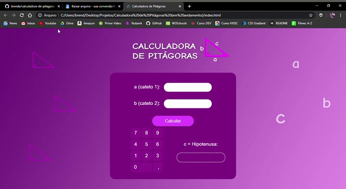

<h1 align="center">
  Calculadora de Pitágoras
</h1>

### Este é o meu quinto projeto desenvolvido com o objetivo de colocar em prática os conhecimentos obtidos durante o aprendizado de Desenvolvimento Web. E através dos repositórios está sendo possível acompanhar uma timeline da minha evolução.
________
 
### 📚 Tecnologias utilizadas:
* CSS
* HTML

### ✨ Sobre o projeto e o que eu aprendi:
O desafio era desenvolver o layout de uma calculadora capaz de calcular a relação entre os lados de um triângulo 
retângulo (mais conhecido como Teorema de Pitágoras). O design foi desenvolvido por uma integrante do grupo e então tivemos que recriar o layout utilizando HTML e CSS.

*Para este projeto eu aprendi como utilizar modelos de maixa, propriedades width e height, padding e margin e personalização de botões.*

### 📷 GIF do site:

________

<h4 align="center">
  Feito com ❤ by Brenda Miranda
</h4>
