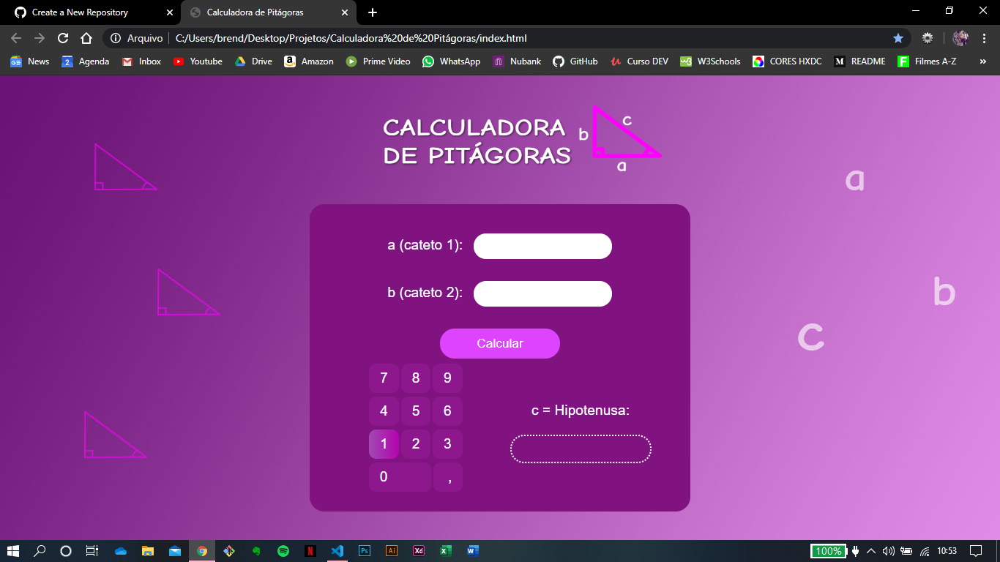

# Calculadora de Pitágoras

### Projeto desenvolvido através de um desafio proposto em um grupo no Whatsapp. 
A meta era desenvolver o layout de uma calculadora capaz de calcular a relação entre os lados de um triângulo 
retângulo (mais conhecido como Teorema de Pitágoras).

Estando cumprido o desafio, este é o meu quarto projeto desenvolvido com o objetivo de aprimorar os 
meus conhecimentos durante o meu aprendizado em Desenvolvimento Web.

Através dos repositórios está sendo possível acompanhar a minha evolução no aprendizado.

### ~ Para este projeto, eu pude colocar em prática meus conhecimentos em: 
* Formulários
* Modelos de Caixa
* Propriedades Width e Height
* Padding e Margin
* Personalização de Botões

## Screenshots do site:

